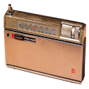
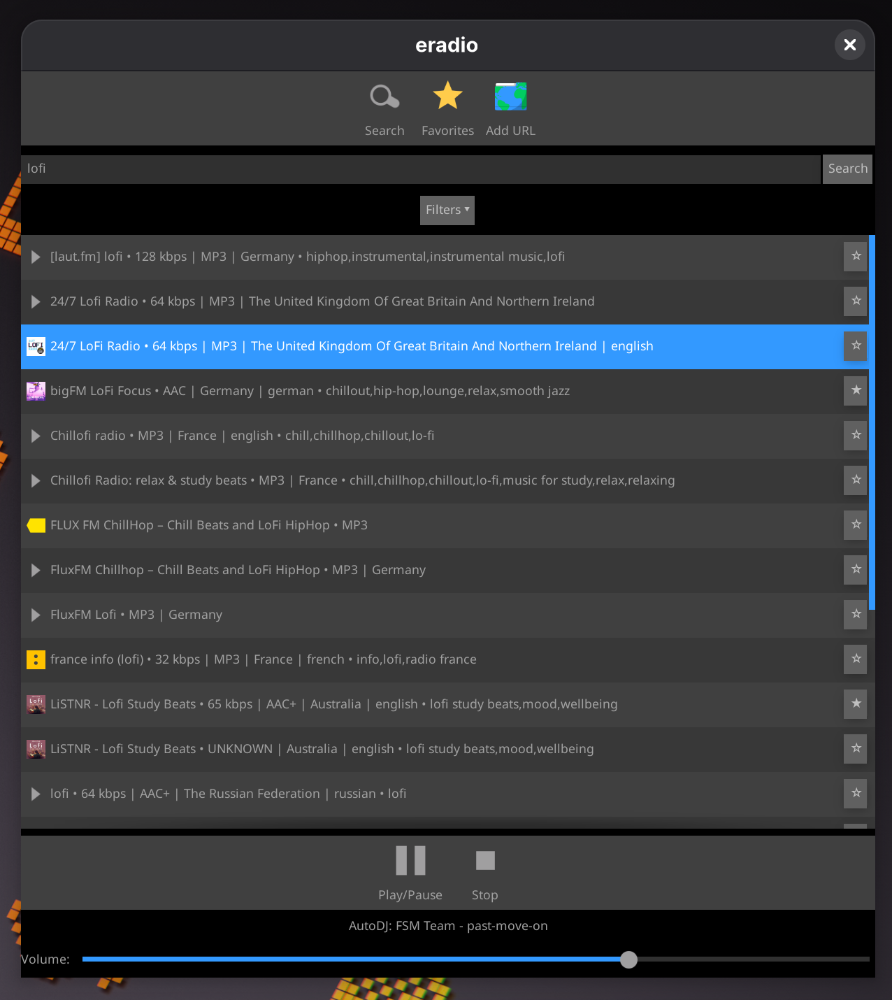

# eradio

A simple internet radio player built with the Enlightenment Foundation Libraries (EFL).



## Screenshot




## Features

- Search for radio stations using the [radio-browser.info](http://radio-browser.info/) API
- List stations with their favicons
- Play, pause, and stop radio streams
- Search by station name, country, language, or tag

## Prerequisites

- `EFL / Elementary`
- `gcc` with C99 support
- `pkg-config`
- `libxml2`

## Project Structure

- `configure.ac` — Autoconf script for project configuration and dependency checks.
- `Makefile.am` — Top-level Automake file.
- `src/main.c` — Entry point and all application logic.
- `src/Makefile.am` — Automake file for the source directory.
- `data/` — Contains data files, such as the `.desktop` file and icon.
- `README.md` — This guide.

## Build & Run

First, generate the build system:

```bash
autoreconf --install
```

Then, configure, build, and run the application:

```bash
./configure
make
./src/eradio
```

To clean the build artifacts:

```bash
make clean
```

## Code Overview

The application initializes Elementary, creates a window with a search bar, a results list, and playback controls. It uses `Ecore_Con` to fetch station data from the `radio-browser.info` API, parses the XML response with `libxml2`, and populates a list. The `Emotion` library is used to handle media playback.

## Icon

The application icon is derived from [Vintage Panasonic Two-Band (FM-AM) Transistor Radio, Model RF-800, 9 Transistors, Made In Japan, Circa 1965](https://commons.wikimedia.org/wiki/File:Vintage_Panasonic_Two-Band_(FM-AM)_Transistor_Radio,_Model_RF-800,_9_Transistors,_Made_In_Japan,_Circa_1965_(14633774476).jpg) by [Joe Haupt](https://www.flickr.com/people/12039117@N08) from USA, licensed under the [Creative Commons Attribution-Share Alike 2.0 Generic](https://creativecommons.org/licenses/by-sa/2.0/deed.en) license.


