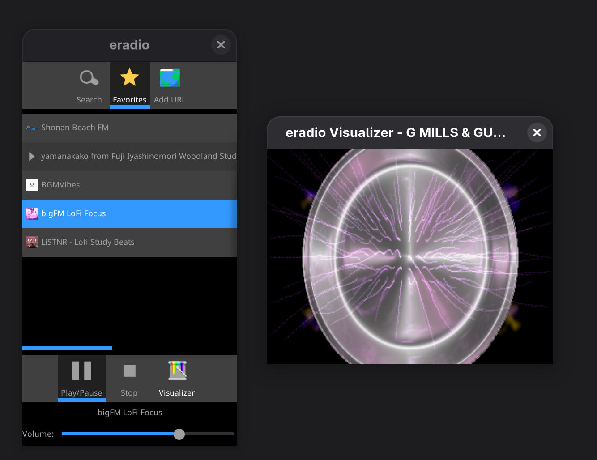

# eradio

A simple internet radio player built with the Enlightenment Foundation Libraries (EFL).


## Screenshot




## Features

- Search for radio stations using the [radio-browser.info](http://radio-browser.info/) API
- List stations with their favicons
- Play, pause, and stop radio streams
- Search by station name, country, language, or tag
- Save favorite radio stations locally
- Add custom radio station URLs manually

## Favorites Storage

Favorite radio stations are saved locally in XML format at:
```
~/.config/eradio/favorites.xml
```

### XML Format

The favorites file uses a simple XML structure to store station metadata:

```xml
<?xml version="1.0" encoding="UTF-8"?>
<favorites version="1">
  <station uuid="station-uuid-here" name="Station Name"
           url="http://example.com/stream.mp3"
           favicon="http://example.com/icon.png"/>
  <station uuid="another-uuid" name="Another Station"
           url="http://example.org/stream"/>
</favorites>
```

### Element Attributes

Each `<station>` element can contain the following attributes:

- **`uuid`** (optional): Unique identifier from the radio-browser.info API
- **`name`** (optional): Human-readable station name
- **`url`** (optional): Stream URL for the radio station
- **`favicon`** (optional): URL to the station's favicon image

**Note:** Either `uuid` or `url` must be present for a station entry to be valid. The `uuid` is used as the primary key when available, with `url` as fallback.

### File Operations

- The file is automatically created when you add your first favorite station
- Favorites are saved atomically using a temporary file and rename operation
- The file can be manually edited - changes will be loaded when the application starts

## Prerequisites

- `EFL / Elementary`
- `gcc` with C99 support
- `pkg-config`
- `libxml2`

## Build & Run

First, generate the build system:

```bash
autoreconf --install
```

Then, configure, build, and run the application:

```bash
./configure
make
./src/eradio
```

To clean the build artifacts:

```bash
make clean
```

## Code Overview

The application initializes Elementary, creates a window with a search bar, a results list, and playback controls. It uses `Ecore_Con` to fetch station data from the `radio-browser.info` API, parses the XML response with `libxml2`, and populates a list. The `Emotion` library is used to handle media playback.

## Icon

The application icon is derived from [Vintage Panasonic Two-Band (FM-AM) Transistor Radio, Model RF-800, 9 Transistors, Made In Japan, Circa 1965](https://commons.wikimedia.org/wiki/File:Vintage_Panasonic_Two-Band_(FM-AM)_Transistor_Radio,_Model_RF-800,_9_Transistors,_Made_In_Japan,_Circa_1965_(14633774476).jpg) by [Joe Haupt](https://www.flickr.com/people/12039117@N08) from USA, licensed under the [Creative Commons Attribution-Share Alike 2.0 Generic](https://creativecommons.org/licenses/by-sa/2.0/deed.en) license.


